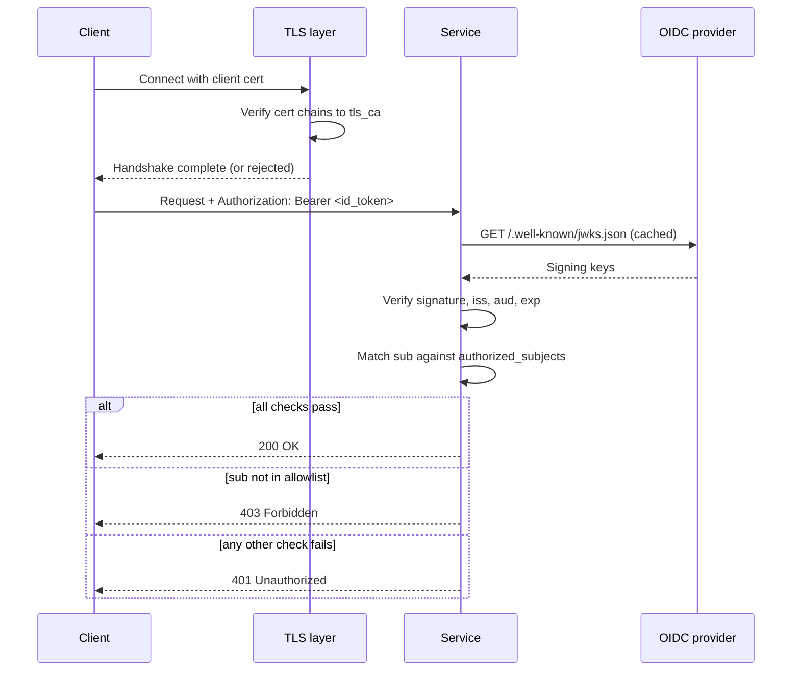
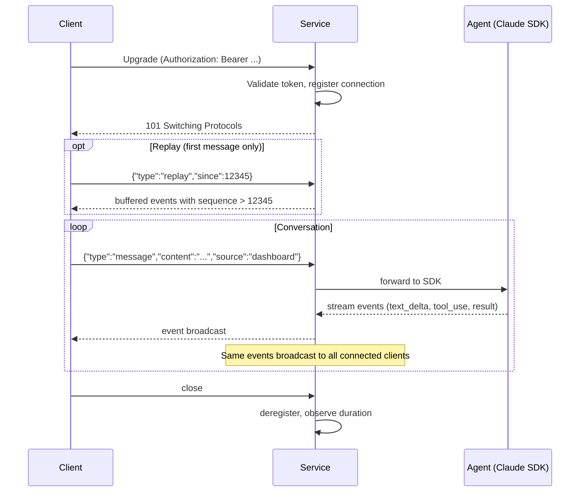
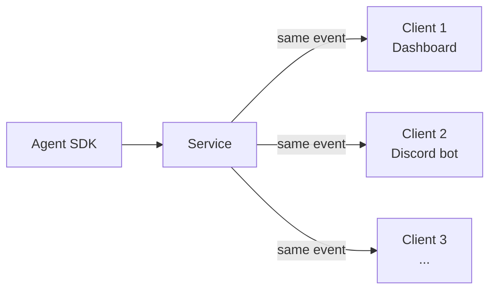

# API Reference

Protocol reference for talking to the agent service. Two surfaces: a small
REST API for management and a single WebSocket for the streaming
conversation.

## Key questions

After reading, you should be able to answer:

- How do I authenticate — what's at the channel layer vs the application layer?
- What REST endpoints exist, and which require auth?
- How does the WebSocket lifecycle work — connect, replay, message, close?
- What can a client send, and what does it get back?
- What event types exist today, and what's in their `data` payload?
- What happens when multiple clients are connected to the same agent?
- What HTTP status codes and error shapes should I expect?

## Auth on every authenticated request



Two layers, both required for authenticated routes:

1. **mTLS at the channel.** Server presents a cert; client must present a
   cert chaining to the server's `tls_ca`. If this fails, no HTTP request
   is ever served — the failure is at the TLS layer.
2. **OIDC bearer at the application.** `Authorization: Bearer <id_token>`
   on every authenticated request, including the WebSocket upgrade.

Unauthenticated routes (`/health`, `/metrics`) skip step 2 but still
require mTLS.

## REST endpoints

| Method | Path | Auth | Purpose |
|--------|------|------|---------|
| `GET` | `/health` | None | Liveness probe |
| `GET` | `/metrics` | None | Prometheus exposition |
| `GET` | `/agent` | OIDC | Agent status and metadata |
| `POST` | `/agent/clear` | OIDC | Clear context, start a fresh session |

### `GET /health`

```http
GET /health
```

**Response** — `200 OK`

```json
{ "status": "ok" }
```

### `GET /metrics`

Prometheus exposition format (`text/plain; version=0.0.4`). Scrape with
your existing Prometheus stack. Metric names:

| Metric | Type | Labels |
|--------|------|--------|
| `agent_tokens_total` | Counter | `token_type` (input/output/cache_read/cache_creation), `model` |
| `agent_messages_total` | Counter | `direction` (inbound) |
| `agent_tool_calls_total` | Counter | — |
| `agent_active_seconds` | Summary | — |
| `ws_connections_active` | Gauge | — |
| `ws_connection_duration_seconds` | Histogram | — |
| `auth_attempts_total` | Counter | `result` (success/failure/forbidden) |
| `agent_errors_total` | Counter | `error_type` |

### `GET /agent`

```http
GET /agent
Authorization: Bearer <id_token>
```

**Response** — `200 OK`

```json
{
  "agent_id": "my-agent",
  "session_id": "abc123",
  "working_dir": "/home/user/agent-workspace",
  "model": "claude-opus-4-7[1m]",
  "total_cost_usd": 1.4321,
  "total_input_tokens": 12345,
  "total_output_tokens": 6789,
  "timestamp": "2026-04-26T18:30:00+00:00"
}
```

`agent_id` is the basename of `agent_working_dir`. Cost and token totals
accumulate across the lifetime of the service process (mirroring the
Claude Code CLI) — they do not reset on `/agent/clear` or session resume.

### `POST /agent/clear`

```http
POST /agent/clear
Authorization: Bearer <id_token>
```

Disconnects the current SDK session and starts a fresh one. The token/cost
accumulators are preserved; only the conversation context is reset.

**Response** — `200 OK`

```json
{ "status": "cleared" }
```

## WebSocket

```
wss://<host>:<port>/agent/ws
```

Single bidirectional channel. Auth via `Authorization` header on the
upgrade request. The service accepts the connection, registers it for
fan-out, and listens for messages.

### Connection lifecycle



### Client → server

Two message types. The client sends JSON over the WebSocket text frames.

**`message`** — send a user message to the agent:

```jsonc
{
  "type": "message",
  "content": "what's on my list today?",
  "source": "dashboard"   // optional — identifies which client sent this
}
```

`source` propagates through the resulting events so other clients can show
context like "this came from Discord." It is not used for routing.

**`replay`** — request buffered events on connect (first message only):

```jsonc
{
  "type": "replay",
  "since": 12345              // sequence number — replay events with sequence > 12345
}
// or
{
  "type": "replay",
  "since": "2026-04-26T17:00:00Z"   // ISO 8601 — replay events after this time
}
```

A `replay` sent after the first message is rejected with
`{"error": "replay only valid as first message"}`. Replay range is
bounded by `replay_buffer_size` — events older than the buffer are
permanently lost. Clients that need to recover from a longer outage can
ask the agent for a summary instead.

### Server → client

Two well-defined message types — `event` and `error`. Schemas are open:
clients **must tolerate unknown fields** so the protocol can evolve
without breaking older clients.

**Common fields on every server message:**

| Field | Type | Description |
|-------|------|-------------|
| `type` | string | `"event"` or `"error"` |
| `agent_id` | string | Identifies which agent produced the message |
| `session_id` | string | SDK session identifier |
| `sequence` | integer | Monotonic, assigned by the service. Use this for replay |
| `timestamp` | string | ISO 8601 UTC, assigned by the service |

**`event`** — agent activity:

```jsonc
{
  "type": "event",
  "agent_id": "my-agent",
  "session_id": "abc123",
  "sequence": 12346,
  "timestamp": "2026-04-26T18:30:00.123456+00:00",
  "event_type": "text_delta",   // or "tool_use", "result"
  "data": { "text": "Hello, " }
}
```

Event types currently emitted:

| `event_type` | `data` shape |
|--------------|--------------|
| `text_delta` | `{ "text": "<chunk>" }` — streaming assistant text |
| `tool_use` | `{ "name": "<tool>", "input": { ... } }` |
| `result` | `{ "session_id", "total_cost_usd", "model" }` — emitted at end of turn |

The schema is open — additional event types and fields may appear without
notice.

**`error`** — agent-level error:

```jsonc
{
  "type": "error",
  "agent_id": "my-agent",
  "session_id": "abc123",
  "sequence": 12347,
  "timestamp": "2026-04-26T18:30:01+00:00",
  "content": "failed to send message; see logs"
}
```

**Inline protocol errors** — when the client sends a malformed frame, the
service replies with a non-broadcast shorthand `{"error": "..."}` (no
`agent_id`/`sequence`/etc.). These are connection-local and not buffered
for replay. Examples:

- `{"error": "replay requires 'since' field"}`
- `{"error": "replay only valid as first message"}`
- `{"error": "message requires 'content' field"}`

### Fan-out semantics



Every event the agent produces is broadcast to **every** connected client.
There is no per-client filtering. The agent itself is unaware of how many
clients are attached.

Messages from any client go into a single queue — if two arrive close
together, they're processed sequentially. There is no conflict resolution
because the design assumes a single user across multiple clients.

## Status codes (REST)

| Code | Meaning |
|------|---------|
| 200 | Success |
| 401 | Missing or invalid bearer token |
| 403 | Valid token, but `sub` not in `authorized_subjects` |
| 422 | Request body validation failed |
| 500 | Server error — check logs |

Error response bodies follow FastAPI's default `{"detail": "..."}` shape.
The service deliberately does not leak internal exception messages — the
detail is always one of `Missing Authorization header`,
`Invalid Authorization header format`, `Authentication failed`, or
`Forbidden`.

## Open questions

- **Protocol versioning.** No version field on messages, no `Sec-WebSocket-Protocol`
  negotiation. The schema-is-open posture covers additive changes — clients
  must tolerate unknown fields. Breaking changes have no formal mechanism
  yet; the implicit policy is "don't make breaking changes."
- **Heartbeat / liveness.** No application-level ping/pong. Clients rely
  on TCP / TLS keepalives and uvicorn's defaults. A NAT-dropped connection
  may look alive until the next message attempt. Whether to add an explicit
  ping is open.
- **Message size limits.** Not bounded by the application. uvicorn's
  defaults apply (~16 MiB for HTTP body, WebSocket frame size depends on
  config). Worth pinning an explicit maximum on `content` length and
  documenting it.
- **Tool result events.** Today, only `tool_use` is emitted — the *output*
  of a tool call is not surfaced as a distinct event type and may be woven
  into subsequent `text_delta` events. Whether to add `tool_result` as a
  first-class event is open.
- **Fan-out scaling.** `broadcast` is O(N) over connected clients per
  event. There's no documented client-count cap. For the planned
  deployment (≤ 5 clients) this is irrelevant; for any larger deployment
  it should be measured and probably bounded.
- **Replay format.** `since` accepts either a sequence number or an ISO
  timestamp. The dual format is convenient but ambiguous when the
  service migrates hosts (sequence resets to 0). Whether to drop the
  timestamp form, or add a session-scoped sequence, is open.
