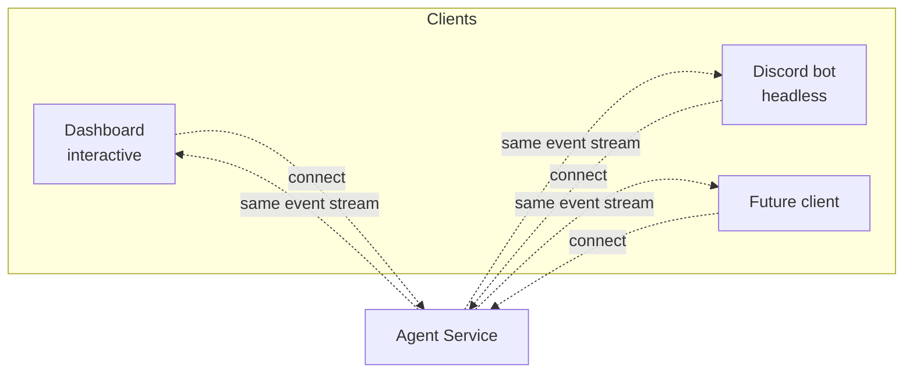
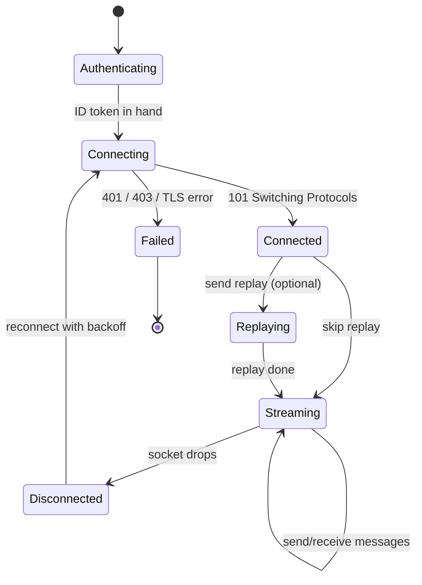
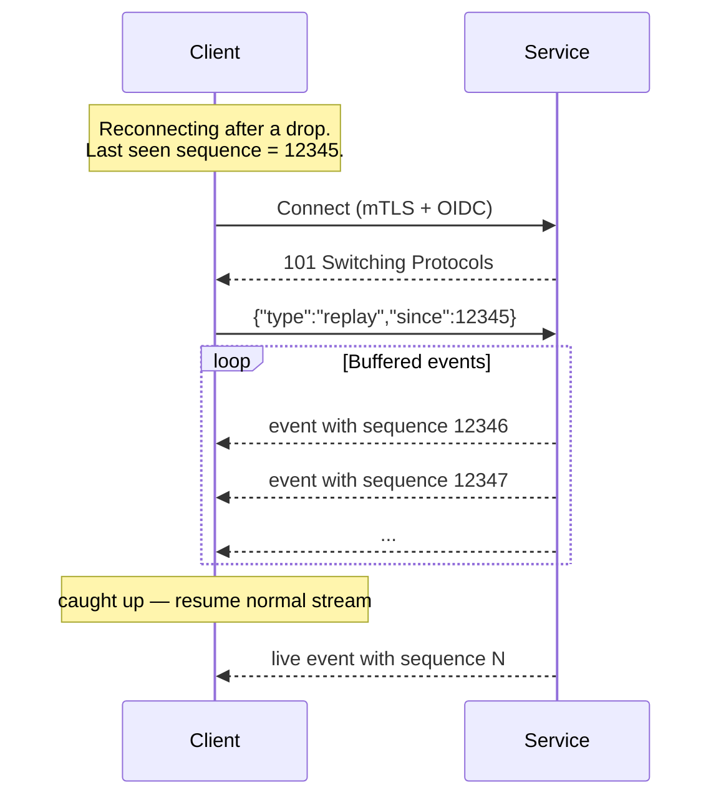
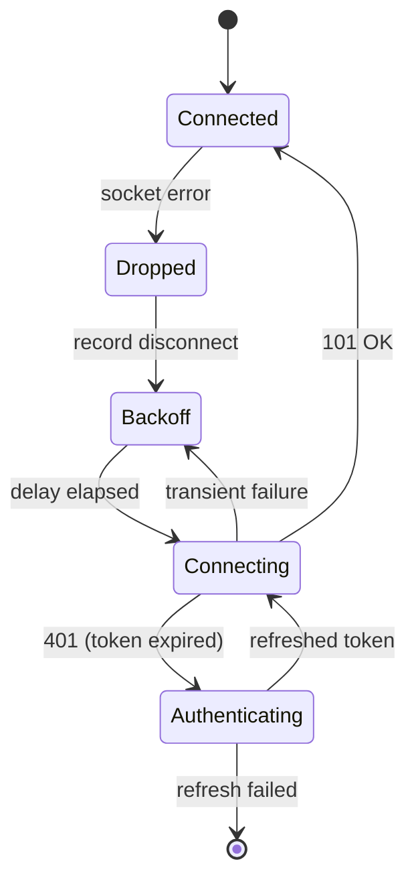

# Client Guide

How to write a client (dashboard, bot, CLI, anything else) that talks to
the agent service. The protocol details are in [`api.md`](api.md); this
guide is about the patterns that make a robust client.

## Key questions

After reading, you should be able to answer:

- What credentials do I need before I write a single line of client code?
- How do I obtain an OIDC token if my client is headless instead of interactive?
- What's the connect → replay → stream lifecycle, and what state must I track?
- How should I handle reconnection — backoff, replay, token refresh?
- How do I render events safely as the protocol evolves?
- What do I need to know about other clients sharing the same agent?

## What a client is

A client is anything that holds an mTLS keypair, an OIDC ID token, and a
WebSocket connection. The dashboard is one client. The Discord bot is
another. They co-exist on the same agent and see the same event stream.



## What you need to start

- The CA bundle (`ca.pem` from the operator)
- A client cert and key issued under that CA, with a CN that's distinct
  per client
- An OIDC ID token — how you get one depends on whether your client is
  interactive or headless (see below)
- The service's `host:port`

## Client lifecycle



Three concrete states a client must handle: **connect**, **replay
decision**, and **steady-state streaming with reconnect**.

## Obtaining an OIDC ID token

Two patterns depending on the client type.

### Interactive client (dashboard)

Standard OAuth authorization-code flow against the IdP:

1. User clicks "log in"
2. Client opens a browser to the IdP's authorize URL
3. User grants the requested scope
4. IdP redirects back to the client's callback with an authorization code
5. Client exchanges the code for an ID token
6. Client stores the token in memory; refreshes silently before expiry

For GitHub specifically, request only `read:user` — you need identity, not
access to repos or anything else.

### Headless client (Discord bot, CI runner)

GitHub OAuth Apps don't support a true machine-to-machine grant, which
means a headless client has two viable patterns:

1. **Device flow at provisioning, refresh forever.** Run the device flow
   once when the bot is set up. Persist the refresh token. The bot mints
   ID tokens silently from then on. Brittle if the IdP session expires.
2. **Cert-as-identity.** When this is wired up, the bot authenticates by
   client cert subject alone. See `Plan-step-ca-management-future.md` for
   the open design and the deferred work — initial scope still requires
   an OIDC bearer.

## Connecting

Pseudocode (Python-flavored, not specific to any one client):

```python
import ssl, websockets

ssl_ctx = ssl.create_default_context(cafile="ca.pem")
ssl_ctx.load_cert_chain(certfile="client.pem", keyfile="client-key.pem")

async with websockets.connect(
    "wss://agent.example.com:8443/agent/ws",
    ssl=ssl_ctx,
    additional_headers={"Authorization": f"Bearer {id_token}"},
) as ws:
    ...
```

The mTLS handshake fails before any HTTP is exchanged if your client cert
isn't trusted. The bearer is checked at the WebSocket upgrade — a 401 or
403 there means your token is bad or your `sub` isn't allowlisted.

## Replay strategy



Track the **highest `sequence`** you've successfully processed. On
reconnect, send `{"type": "replay", "since": <last_sequence>}` as your
**first** frame. Anything later than first is rejected.

The replay buffer is bounded — `replay_buffer_size` events on the
service. If your client was offline long enough that the buffer rolled
past your last sequence, the gap is unrecoverable. Two reasonable
fallbacks:

- Show the user a notice that some events were missed
- Send the agent a message asking for a summary of what happened

A long-lived bot rarely hits this — the buffer is sized to cover normal
restart windows. A frequently-restarted dashboard hits it the most.

## Reconnection



- **Exponential backoff with jitter.** Start at ~1s, cap at ~30s. Don't
  reconnect tighter than that — auth failures still cost the IdP.
- **Distinguish transient from terminal.** A 401 means refresh your token
  before retrying. A 403 means stop — the operator removed your `sub`
  from the allowlist.
- **Always replay on reconnect.** The buffer is bounded, but you'll
  almost always recover something.

## Sending messages

```jsonc
{
  "type": "message",
  "content": "user input here",
  "source": "dashboard"
}
```

The `source` field is informational — it propagates into events so other
clients can render "this came from Discord." Use a stable, lowercase
identifier per client (`dashboard`, `discord`, `cli`, etc.). Don't put
PII or session tokens in there.

Multi-client implication: if two clients send messages within
milliseconds of each other, the agent processes them sequentially in the
order they arrived at the service. Your client's message may be
preceded by another client's message in the agent's view of the
conversation.

## Handling events

Required reading: every server message has `type`, `agent_id`,
`session_id`, `sequence`, `timestamp`. Beyond those, the schema is open
— **clients must tolerate unknown fields**.

Today's event types:

| `event_type` | What to render |
|--------------|----------------|
| `text_delta` | Streaming assistant text — append to the current response in the UI |
| `tool_use` | Display "agent is calling `<name>` with `<input>`" |
| `result` | End of turn — surface cost / model in a footer or statusline |

The service may add new event types without notice. A client should:

- Branch on known `event_type` values and render them
- For unknown `event_type`, log and ignore (don't crash)

For `error` messages, surface the `content` to the user but don't tear
down the connection — these are agent-level errors, not transport errors.

## Discord bot output filtering

Specific to the Discord client and worth restating: the bot must **not**
forward every event to Discord. Forward only summaries and final
responses. Substantive data (token streams, tool calls) stays on the
dashboard side. This matches the Discord ToS / Developer Policy posture
and keeps "App Content" off Discord.

Use slash commands for input rather than reading message content
passively — explicit user intent, cleaner boundary under Developer Policy
Rule 21.

## Reference: minimal Python client

```python
import asyncio
import json
import ssl
import websockets

last_sequence = 0

async def run(token: str, host: str, port: int):
    global last_sequence

    ssl_ctx = ssl.create_default_context(cafile="ca.pem")
    ssl_ctx.load_cert_chain(certfile="client.pem", keyfile="client-key.pem")

    backoff = 1
    while True:
        try:
            async with websockets.connect(
                f"wss://{host}:{port}/agent/ws",
                ssl=ssl_ctx,
                additional_headers={"Authorization": f"Bearer {token}"},
            ) as ws:
                if last_sequence > 0:
                    await ws.send(json.dumps({"type": "replay", "since": last_sequence}))
                backoff = 1
                async for raw in ws:
                    msg = json.loads(raw)
                    if "sequence" in msg:
                        last_sequence = max(last_sequence, msg["sequence"])
                    handle(msg)
        except Exception as e:
            print(f"disconnected: {e}; retrying in {backoff}s")
            await asyncio.sleep(backoff)
            backoff = min(backoff * 2, 30)

def handle(msg):
    if msg.get("type") == "event":
        et = msg.get("event_type")
        data = msg.get("data") or {}
        if et == "text_delta":
            print(data.get("text", ""), end="", flush=True)
        elif et == "tool_use":
            print(f"\n[tool: {data.get('name')}]")
        elif et == "result":
            print(f"\n[done: ${data.get('total_cost_usd'):.4f}]")
    elif msg.get("type") == "error":
        print(f"\n[error] {msg.get('content')}")
```

This is illustrative, not production-ready: real clients add token
refresh on 401, structured error handling, and richer rendering.

## Open questions

- **Heartbeat.** The service emits no application-level ping. Should
  clients implement their own keepalive to detect silent NAT drops? Or
  rely on TLS keepalives? Unsettled.
- **Token refresh on 401 mid-stream.** The illustrative client doesn't
  show this. The right pattern is probably "refresh token, then
  reconnect with replay" — but the IdP-specific refresh code lives
  outside this protocol and isn't documented per-client.
- **Reference clients.** Only the Python skeleton above is provided.
  Tkinter (dashboard) and Discord clients live in their own repos; link
  them here once stable.
- **Out-of-band messaging between clients.** The `source` field is
  informational only. If two clients ever needed to coordinate
  (e.g., "dashboard tells the bot to suppress its next forward"), the
  protocol has no path for it. Open whether this is ever needed.
- **Local development without full prod setup.** See
  [development.md](development.md) for the current best-effort path
  and its own open questions.
