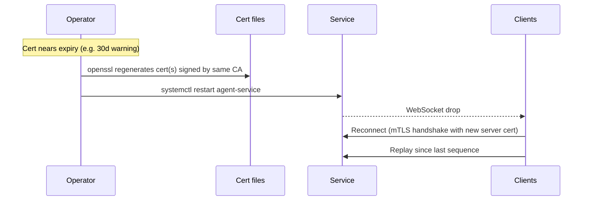
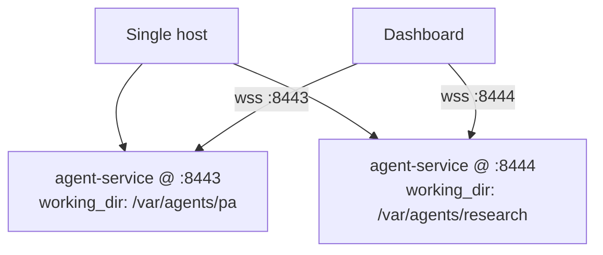

# Operations Guide

Day-2 operations: running the service past the first launch, keeping it
healthy, and recovering when things break.

## Key questions

After reading, you should be able to answer:

- How do I run this as a real system service that survives reboots?
- How do I upgrade the service without losing in-flight clients?
- How do I rotate certificates when they near expiry?
- How do I run more than one agent on the same host?
- How is the agent's tool/permission allowlist configured?
- What stops runaway token spend?
- Where do logs go and how do I keep them from filling the disk?
- What do I need to back up to recover from host loss?

## Running as a system service

### Linux (systemd)

Drop a unit at `/etc/systemd/system/agent-service.service`:

```ini
[Unit]
Description=Agent Service
After=network-online.target
Wants=network-online.target

[Service]
Type=simple
User=agent
Group=agent
WorkingDirectory=/opt/agent-service
ExecStart=/opt/agent-service/.venv/bin/python -m agent_service /etc/agent-service/config.yaml --log-file /var/log/agent-service/service.log
Restart=on-failure
RestartSec=5

[Install]
WantedBy=multi-user.target
```

```bash
sudo systemctl daemon-reload
sudo systemctl enable --now agent-service
sudo systemctl status agent-service
```

### Windows

The service has no native Windows-service mode. Two paths:

1. **NSSM** (`https://nssm.cc/`) wraps any executable as a Windows service.
   Point it at `python.exe -m agent_service config.yaml`.
2. **Task Scheduler** with a "Run on system startup" trigger and a
   "Restart on failure" action.

## Upgrading

The service holds in-memory agent state (per-process token accumulator,
session ID, WebSocket connections). Upgrades are restart-style — there is
no hot reload.

```bash
# 1. Pull and reinstall
cd /opt/agent-service
git pull
.venv/bin/python -m pip install -e ".[dev]"

# 2. Run the read-only quality gate against the new code
make check

# 3. Restart
sudo systemctl restart agent-service

# 4. Verify
curl --cacert ca.pem https://localhost:8443/health
```

Connected clients see the WebSocket drop and reconnect. Replay covers any
events emitted before the restart, bounded by `replay_buffer_size`.
Mid-turn restarts lose the in-flight turn — the agent's session resumes,
but the partial response does not.

## Cert rotation runbook (manual posture)

For the manual cert path documented in [setup.md](setup.md#generate-certificates-manual--openssl).
For automated rotation, see [step-ca management (deferred)](future/step-ca-management.md).



Per-client cert rotation works the same — issue a new client cert, ship
it to the client (with its key), the client reconnects on next attempt.

**Rotation policy decision** that should be written down somewhere
durable (project root, ops wiki):

- Cert TTL chosen and why
- Calendar reminder cadence (e.g., 30d before expiry)
- Owner of the rotation procedure

## Running multiple agents on one host

One service instance hosts exactly one agent. To run a second, run a
second service instance with its own:

- Config file (different `agent_working_dir`, `listen_address`, log file)
- Server cert with a SAN matching its bind address
- systemd unit (e.g., `agent-service@pa.service` and
  `agent-service@research.service` using template units)



The dashboard connects to each instance separately. There is no
multiplexing layer.

## Agent tool / permission configuration

The service applies a deny-by-default policy at the SDK callback layer
(`agent_service/agent.py`): any tool call not pre-approved by SDK
permission settings is denied with a clear message.

What the agent can actually use is determined by the Claude Agent SDK's
permission model — settings the SDK reads from the working directory and
higher-precedence locations. For the canonical reference, see the
Claude Code permissions docs.

The service does not duplicate or shadow the SDK's permission config. To
grant the agent access to a new tool:

1. Edit the SDK settings the agent picks up from its working directory
2. Restart the service so the SDK reloads them
3. Verify by sending a message that exercises the new tool and watching
   the resulting `tool_use` event vs. an error

## Cost and quota guardrails

There is no hard cap today. The service reports:

- `agent_tokens_total{token_type, model}` — input, output, cache_read,
  cache_creation
- `agent_messages_total{direction}` — inbound message rate
- `agent_tool_calls_total` — tool call count

Alert on rate-of-change against your usual baseline. A sudden spike
in `agent_tokens_total{token_type="output"}` is the cleanest "agent
went wild" signal.

Hard rate limiting is on the deferred-scope list. Until it's wired,
your only stop-button is `systemctl stop agent-service` or
`POST /agent/clear` to reset context (which doesn't stop in-flight
turns).

## Logs

The `--log-file` flag writes to a single file in append mode. The
service does not rotate it. Two ways to keep disk usage bounded:

### Linux (logrotate)

`/etc/logrotate.d/agent-service`:

```
/var/log/agent-service/*.log {
    weekly
    rotate 8
    compress
    delaycompress
    missingok
    notifempty
    copytruncate
}
```

`copytruncate` avoids needing to signal the service for log reopen.

### Or just journald

Drop the `--log-file` flag. systemd captures stderr to the journal,
which is rotated by `systemd-journald` automatically.

## Backup

What survives a host loss matters. There are three pieces of state:

| State | Where | Why it matters |
|-------|-------|----------------|
| Agent working directory | `agent_working_dir` from config | Files the agent has produced or curated; user data |
| SDK session JSONL | `~/.claude/projects/<project_key>/` | Conversation history; needed if `session_resume_on_startup: true` |
| Configuration | `config.yaml`, cert files | Reproducing the deployment |

`<project_key>` is `agent_working_dir` with `/`, `\`, and `:` replaced
with `-`. A working dir of `/home/user/agent-workspace` becomes
`-home-user-agent-workspace`.

The service does not run periodic snapshots itself — that's an external
concern. A simple cron / systemd timer that `tar`s the three pieces and
ships them somewhere durable is sufficient.

## Open questions

- **Hot reload / SIGHUP-style cert rotation** — would let cert rotation
  happen without dropping clients. Not implemented; restart is the only
  path today.
- **Hard cost cap** — feasible to add a config-driven token-spend ceiling
  per session or per day. Tradeoff: agent suddenly stops mid-task. Worth
  it once the metrics-watch posture proves insufficient.
- **Multi-instance management UX** — running 3+ agents on one host, the
  systemd-template-unit pattern works but isn't documented end-to-end. Add
  a worked example once this happens for real.
- **Disaster recovery procedure** — restoring from the three-piece backup
  to a fresh host. Should be drilled and the runbook captured here.
- **Windows service** — NSSM and Task Scheduler are sketched but not
  battle-tested. Pin a recommendation once one of them is used in anger.
