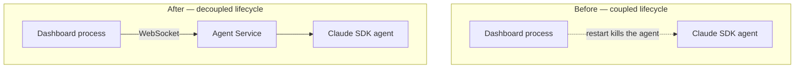
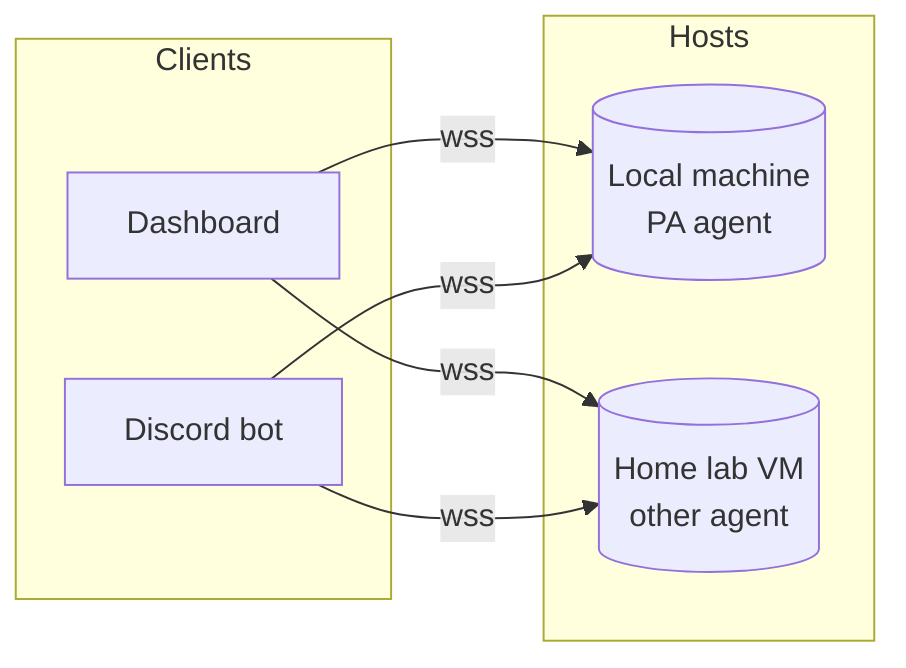

# Overview

Why this project exists, what it is, and how it fits with the dashboard,
Discord bot, and any future clients.

## Key questions

After reading, you should be able to answer:

- What problem does this service solve?
- What is it, technically?
- How does it relate to the dashboard and the Discord bot?
- Why one agent per service instance?
- Where do I go next, depending on what I'm trying to do?

## The problem

Originally, the dashboard and the Claude SDK agent ran in the same process.
Restarting the dashboard — to test a UI change, recover from a crash, ship
an update — killed the running agent session.

The agent is the long-lived thing. The dashboard is the volatile thing.
Tying their lifecycles together is exactly backwards.

## What it is

A standalone FastAPI service that hosts exactly one Claude SDK agent in an
isolated working directory. Clients connect over WebSocket (streaming
conversation) and REST (management). All connections require mTLS at the
channel and OIDC at the application.

- One agent per service instance — hard process-level isolation between
  agents
- Multiple clients per service instance — dashboard, Discord bot, future
  clients all see the same event stream
- Stateless from the client's perspective — agent state lives on the server,
  clients can disconnect and reconnect freely

## How clients fit

The dashboard connects to N service instances — one per agent. Scaling out
means launching another service instance with its own working directory and
config, not stuffing more agents into one process.

The Discord bot is just another client. It speaks the same protocol, holds
its own client cert and OIDC token, and sees the same event stream. The
agent is unaware of how many clients are attached.

## Why one agent per instance

Hard isolation. No shared memory, no shared filesystem, no cross-agent risk
of context bleeding between a "PA" agent that knows your calendar and a
"research" agent that browses the web. The protocol allows multi-agent
consolidation in one instance later if cost/resource pressure justifies it,
but the default posture is one-to-one.

## Where to go next

| You want to | Read |
|-------------|------|
| Stand up a service instance from scratch | [Setup Guide](setup.md) |
| Understand the wire protocol | [API Reference](api.md) |
| Write a new client (dashboard, bot, CLI) | [Client Guide](client-guide.md) |
| Develop a client without a full prod setup | [Development Guide](development.md) |
| Run, monitor, upgrade, back up | [Operations Guide](operations.md) |
| Plan automated CA tooling for later | [step-ca Management (deferred)](future/step-ca-management.md) |

## Open questions

- **Naming and discovery.** When a dashboard connects to multiple service
  instances, how does it know which is which? Today, `agent_id` is the
  basename of `agent_working_dir` — fine for one user, but no central
  registry exists.
- **Cross-agent messaging.** Two agents on the same host, both addressable
  by the dashboard — is there ever a reason for them to talk to each other?
  Out of scope today; flag if it ever comes up.
