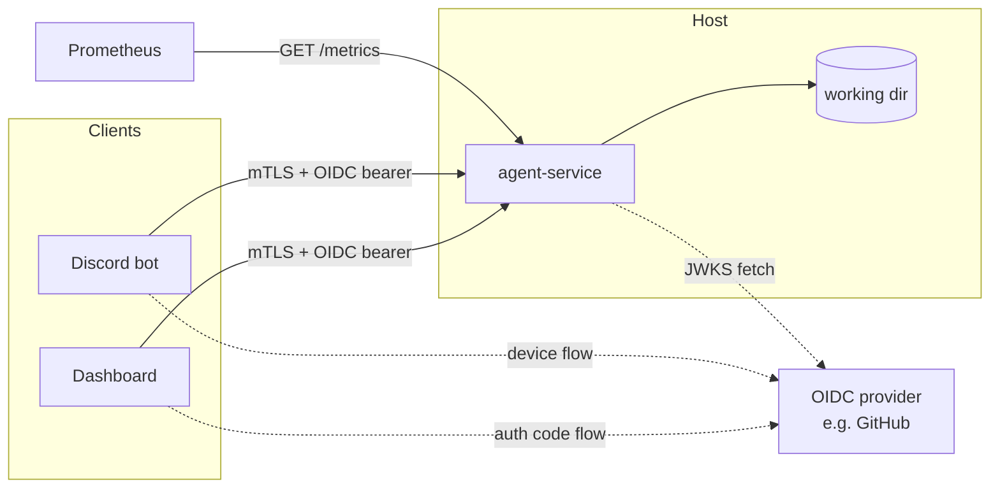

# Setup Guide

Operator-facing setup for a single agent service instance. Covers
prerequisites, certificate generation, OIDC provider registration,
configuration, and verification.

## Key questions

After reading, you should be able to answer:

- What do I need installed and ready before I start?
- How do I generate the mTLS certificates by hand?
- How do I register an OIDC provider, and what scopes does it need?
- What does every config field mean, and which are required?
- How do I run the service and verify it's actually up?
- What does each common startup or auth failure look like?

## Prerequisites

- Python 3.12 or later
- `openssl` (for the manual cert path) or `step-cli` if you've stood up an
  internal CA — see `Plan-step-ca-management-future.md`
- A GitHub account capable of registering an OAuth App, or another OIDC
  provider you can validate ID tokens against
- A working directory the agent will operate inside (separate from the
  service's own install location)

## Topology at a glance



One agent per service instance. Multiple clients connect to the same instance
and see the same event stream. To run a second agent, deploy a second
service instance with its own working directory.

## Install

```bash
git clone https://github.com/jewzaam/agent-service.git
cd agent-service
make install-dev
```

`make install-dev` creates a `.venv/` and installs the package in editable
mode with dev dependencies. Use `make install-pipx` for a global install
once you're past the experimentation phase.

## Generate certificates (manual / openssl)

The service uses mTLS — the server presents a cert and requires every client
to present a cert chained to the same CA. For the initial deployment posture
you generate these by hand. (For automated issuance, see
`Plan-step-ca-management-future.md`.)

```bash
# 1. Create a private CA
openssl genrsa -out ca-key.pem 4096
openssl req -new -x509 -days 365 -key ca-key.pem \
    -subj "/CN=agent-service-ca" -out ca.pem

# 2. Server cert (replace agent.example.com with your service hostname)
openssl genrsa -out server-key.pem 4096
openssl req -new -key server-key.pem \
    -subj "/CN=agent.example.com" -out server.csr
openssl x509 -req -days 365 -in server.csr \
    -CA ca.pem -CAkey ca-key.pem -CAcreateserial \
    -out server.pem

# 3. Client cert (one per client — give each a unique CN)
openssl genrsa -out dashboard-key.pem 4096
openssl req -new -key dashboard-key.pem \
    -subj "/CN=dashboard-naveen" -out dashboard.csr
openssl x509 -req -days 365 -in dashboard.csr \
    -CA ca.pem -CAkey ca-key.pem -CAcreateserial \
    -out dashboard.pem
```

Move the server keys to a path the service can read (e.g.,
`/etc/agent-service/certs/`). Distribute `ca.pem` plus a per-client
keypair to each client. Keep `ca-key.pem` offline.

## Register an OIDC provider (GitHub OAuth App)

1. **Settings → Developer settings → OAuth Apps → New OAuth App**
2. Set the homepage and callback URL to wherever your dashboard runs (the
   service itself is not the OAuth callback target — the *client* is)
3. Request only `read:user` scope — no repo, gist, or other access
4. Note the issuer URL (`https://token.actions.githubusercontent.com` for
   Actions OIDC, or your provider's issuer for OAuth flows) and the
   audience claim your dashboard will request
5. Get the GitHub user ID (numeric `sub` claim) for every authorized
   user — these go into `authorized_subjects`

Google works too with `openid email profile` scopes — same identity-only
posture.

## Configure

Copy the example config and edit:

```bash
cp config.example.yaml config.yaml
$EDITOR config.yaml
```

| Key | Meaning |
|-----|---------|
| `agent_working_dir` | Filesystem path the agent operates inside |
| `tls_cert` / `tls_key` | Server cert and key paths |
| `tls_ca` | CA cert — clients must chain to this |
| `oidc_issuer` | OIDC provider issuer URL |
| `oidc_audience` | Expected `aud` claim on incoming tokens |
| `authorized_subjects` | Allowlist of OIDC `sub` values |
| `replay_buffer_size` | Number of events retained for reconnect replay |
| `session_resume_on_startup` | `true` resumes the last SDK session, `false` starts fresh |
| `listen_address` | `host:port` to bind |
| `chat_model` *(optional)* | Pin a Claude model; leave unset to defer to the SDK CLI default |
| `source_system` *(optional)* | Identifier for AgentPulse statusline payloads |

Every field except those marked optional is **required**. The service
refuses to start with missing keys — there are no defaults.

### Environment variable overrides

Any field can be overridden with `AGENT_SERVICE_{FIELD_UPPER}`. List fields
(`authorized_subjects`) accept comma-separated values. Useful for secrets
you don't want in the config file:

```bash
export AGENT_SERVICE_AUTHORIZED_SUBJECTS="123456,789012"
```

### Optional: AgentPulse statusline forwarding

If a config file exists at `~/.claude/agentpulse/config.json` containing
`{"host": "...", "port": ...}`, the agent forwards per-turn cost/token data
to that endpoint after every SDK `ResultMessage`. If the file is missing or
malformed, forwarding is silently disabled. No service-side configuration
is needed.

## Run

```bash
python -m agent_service config.yaml
```

Optional flags:

- `--debug` — enable DEBUG logs
- `--quiet` / `-q` — suppress INFO logs
- `--log-file PATH` — write logs to a file instead of stderr

The service refuses to start if config validation fails or the cert files
are unreadable. Errors are logged via the `agent_service` logger.

## Verify

Once running:

```bash
# Health check (no auth)
curl --cacert ca.pem https://agent.example.com:8443/health
# {"status":"ok"}

# Metrics (no auth, but mTLS still required by the channel)
curl --cacert ca.pem \
    --cert dashboard.pem --key dashboard-key.pem \
    https://agent.example.com:8443/metrics

# Agent status (mTLS + OIDC bearer required)
curl --cacert ca.pem \
    --cert dashboard.pem --key dashboard-key.pem \
    -H "Authorization: Bearer $OIDC_ID_TOKEN" \
    https://agent.example.com:8443/agent
```

`/health` is unauthenticated for liveness probes. `/metrics` is also
unauthenticated at the application layer — the mTLS handshake is your
gate. Authenticated endpoints return 401 for missing/invalid tokens and
403 for an unknown subject.

## Troubleshooting

| Symptom | Likely cause |
|---------|--------------|
| `make install-dev` fails on Windows | `.venv\Scripts\python.exe` may need `python3` instead of `python` — check `PY_SYS` in the Makefile |
| Service refuses to start with `Config file not found` | `config.yaml` is missing or the path argument is wrong |
| Service refuses to start with a Pydantic validation error | A required field is missing or the wrong type — error names the offending field |
| Client gets `SSL: CERTIFICATE_VERIFY_FAILED` | Client doesn't trust the server cert — ensure `ca.pem` is in the client's CA bundle |
| Client gets TLS handshake error before HTTP | Client isn't presenting a cert, or its cert doesn't chain to `tls_ca` |
| `401 Authentication failed` | Token signature/issuer/audience/expiration check failed |
| `403 Forbidden` | Token is valid but `sub` is not in `authorized_subjects` |
| `/metrics` shows zero token counters after activity | Counters increment on `ResultMessage` per turn — verify the SDK is producing results, not just streaming text |

## Open questions

- **Resource sizing.** No documented CPU / RAM / disk requirement.
  Depends on agent activity (token throughput) and the SDK's footprint.
  Capture real numbers once the service has been running for a week.
- **Firewall / network exposure.** The service binds to `listen_address`
  and that's the only port to expose. No documented checklist for
  hardening (e.g., bind to a specific interface, restrict source IPs).
- **First-time OIDC token acquisition for the operator.** The setup
  guide assumes the operator already has a token to verify with `curl`.
  No script or recipe is provided — see the dashboard repo for the code
  flow it implements.
- **Repeatable cert generation.** The openssl recipe is hand-typed
  today. Worth promoting to a `scripts/issue-cert.sh` once the same
  steps have been run twice.
